### 主要内容

------

#### 页面主要技术  HTML + css

1. 页面统一采用 flex 布局
2. 左右两边采用固定定位
3. css 样式统一采用 d_（党） 为类名前缀
4. css样式为外部引入样式 包含 index.css 和 details.css
5. 超链接包含 左侧导航，点击切换到各自对应的页面，右侧点击进入详情内容
6. 第三方链接，社交按钮，跳转外部链接，其中包含自己的网站，博客暂时未完善
7. 文章分类，进行锚点，模拟跳转效果
8. 底部分页，制作假的切换效果，切换时页码会变到对应的颜色

#### 主要内容和功能

1. 头像  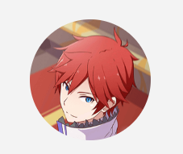

头像展示功能

2. 小标题，只做展示效果，没有链接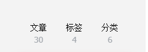

3. 标题导航  跳转后当前项高亮显示 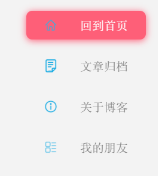点击后会跳转到各自的页面
4.  首页和文章归档页面内容一致 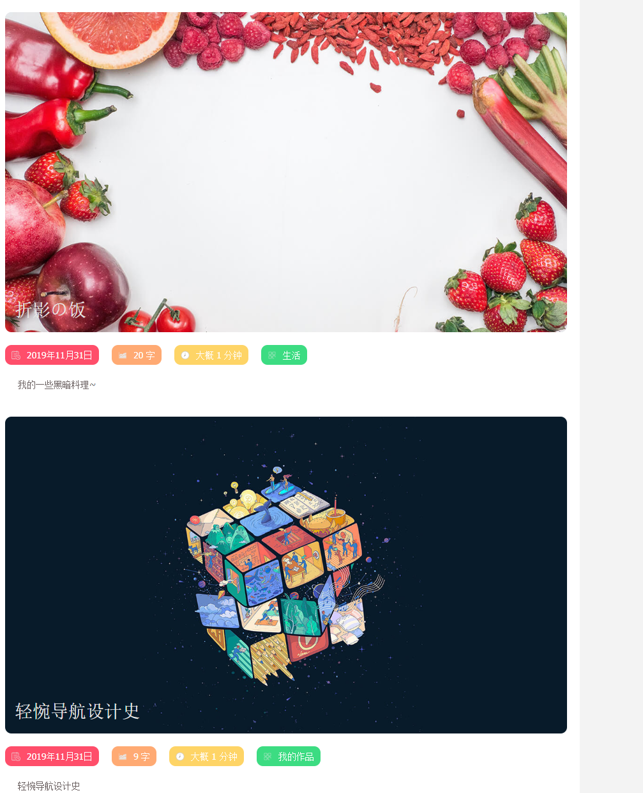其中包含图片 大标题 小标题 ，日期时间，字数，阅读所需时间，所属分类
5. 关于博客 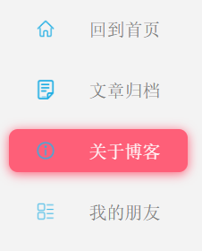内容主要包含博客内容，其中包含登录，登录所输入内容提前写好了，需要点击登录按钮才会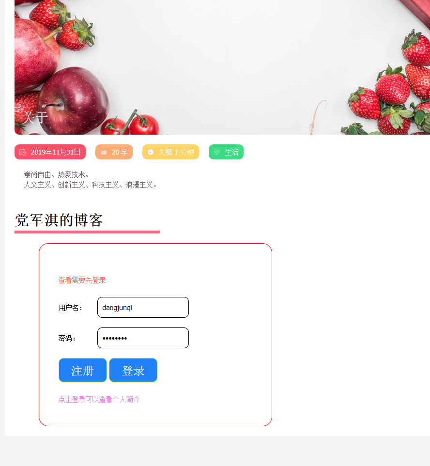跳转到个人信息页面

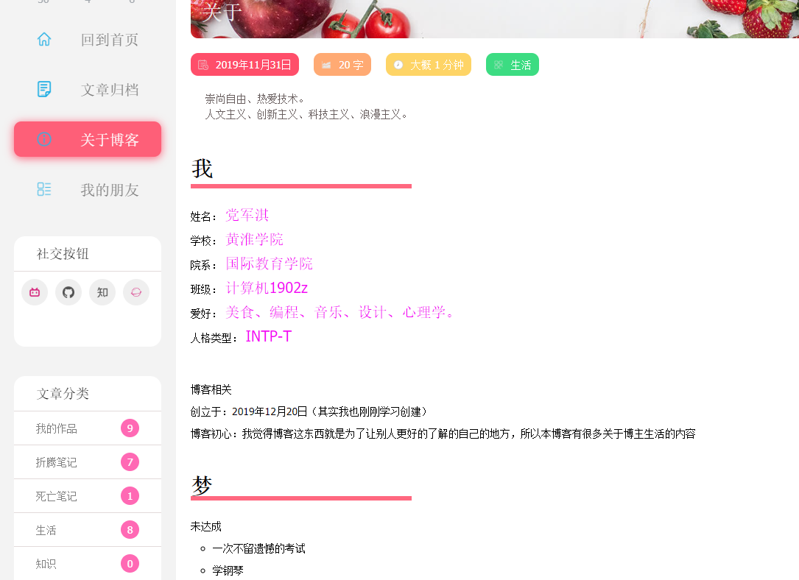

6. 我的朋友

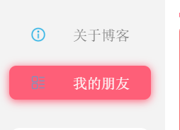是一些跳转第三方的页面，一些看过的网站

7. 社交按钮 里面是一些自己的网站，自己的个人中心，包含哔哩哔哩 ，知乎，GitHub 和博客（未完成）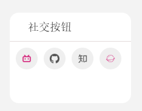

8. 内容详情 ： 一些简介的内容展示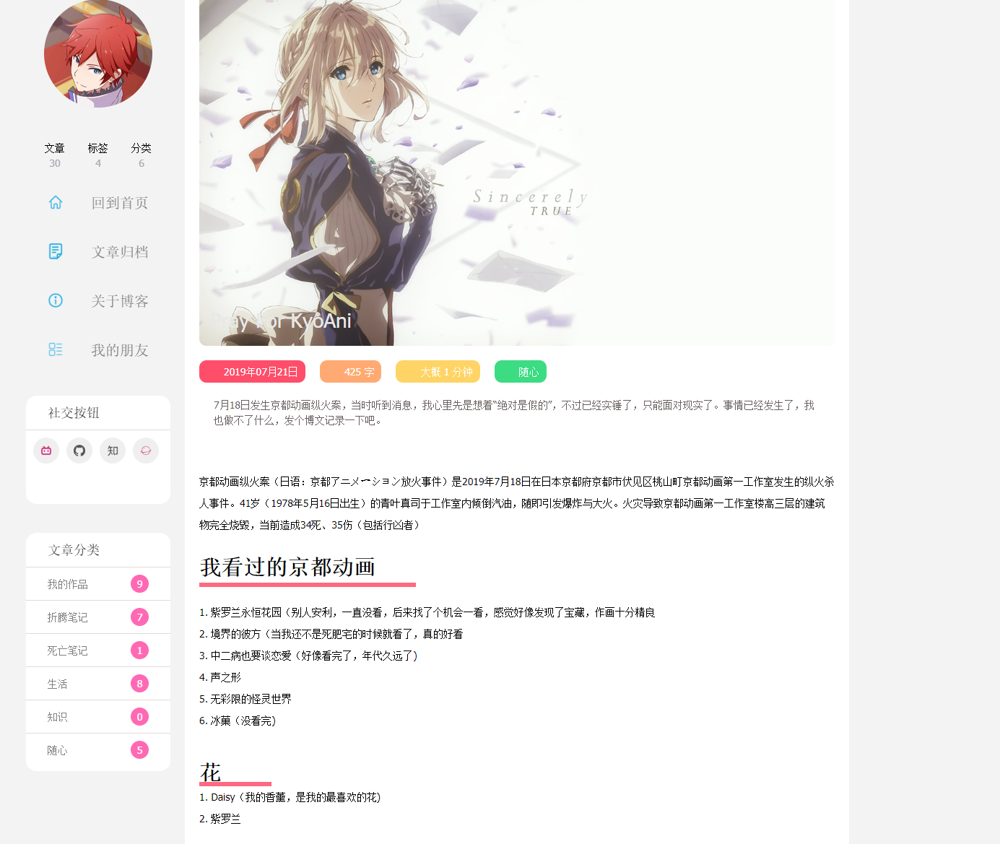

9. 分页效果 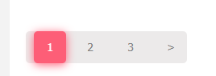点击后切换页码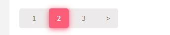